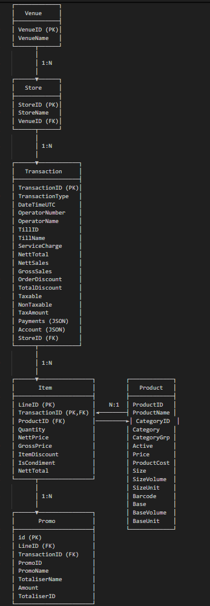

# data_processor

A simple app to process data in local machine, triggered via an API call

## Prerequisites

- **Docker Desktop** - Required for running PostgreSQL locally
- **Python 3.13**
- **uv** package manager- [installation guide](https://docs.astral.sh/uv/guides/install-python/)

## Setup Instructions

### 1. Start PostgreSQL with Docker Compose

Ensure Docker Desktop is installed and running, then start the PostgreSQL server:

`docker-compose up -d`

### 2. Create virtual env using UV

`uv sync`

### 3. Migrate the DB changes to the Postrgesql db in local

`alembic upgrade head`

### 4. Place the input file with the following naming convention inside the input folder

`Venue*_*.json`

### 5. Start the Flask app in debug mode using the debug runner and hit the GET endpoint below to start the processing of the data file

`http://127.0.0.1:5000/data_processor/start`

### 6. ER Diagram for the DB models can be found as below:

